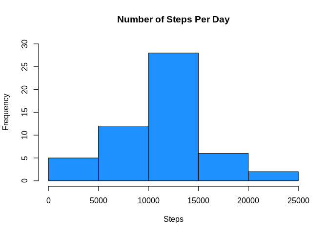
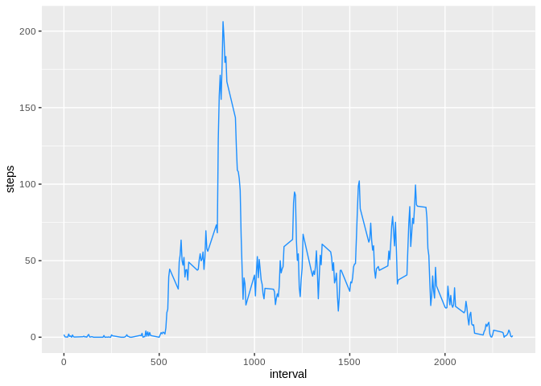
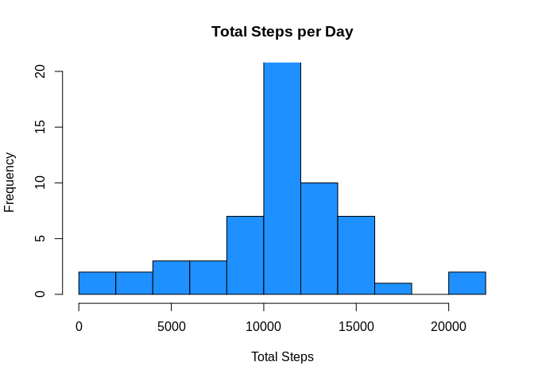
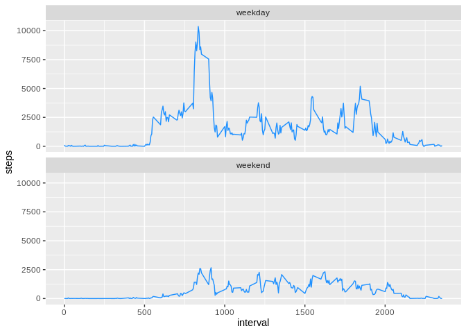

Set working directory and load libraries


```r
setwd("/home/clay/R/JHU_Data_Science/Reproducible Research/Project_1/")
library(dplyr)
library(data.table)
library(varhandle)
library(tidyverse)
```

## Read data into a table, activityData ##


```r
activityData <- data.table(read.csv("/home/clay/R/JHU_Data_Science/Reproducible Research/Project_1/activity.csv"))
```

### What is the mean total number of steps taken per day? ##


```r
activityData$date = unfactor(activityData$date)
firstDay = as.character(activityData[1,2])
lastDay = as.character(activityData[nrow(activityData),2])
numbDays = as.numeric(difftime(as.Date(lastDay), as.Date(firstDay))) + 1
stepsperDay = sum(activityData$steps, na.rm = TRUE) / numbDays
noquote(paste(stepsperDay, "mean total of steps per day"))
```

```
## [1] 9354.22950819672 mean total of steps per day
```

### Calculate number of steps for each day and plot a histogram


```r
stepsDay = na.omit(activityData) %>%
        mutate(month=format(as.Date(date), "%m"), day=format(as.Date(date), "%d")) %>%
        group_by(month, day) %>%
        summarize(steps=sum(steps)) %>% 
        mutate(date=as.Date(paste("2012-", month, "-", day, sep= ""))) %>% 
        ungroup() %>%
        select(date, steps)
hist(stepsDay$steps,
     breaks =6,
     main = "Number of Steps Per Day",
     xlim = c(0, 25000),
     ylim = c(0, 30),
     xlab = "Steps",
     col = "dodgerblue")
```

<!-- -->
        
### Report mean and median of total number of steps per day


```r
noquote(paste(mean(stepsDay$steps), "mean total steps per day"))
```

```
## [1] 10766.1886792453 mean total steps per day
```

```r
noquote(paste(median(stepsDay$steps), "median total steps per day"))
```

```
## [1] 10765 median total steps per day
```

## What is the average daily activity pattern? ##


```r
intervalAvg <- na.omit(activityData) %>% group_by(interval) %>% summarize(steps = 
        mean(steps))
ggplot(data = intervalAvg, mapping = aes(x = interval, y = steps)) +
               geom_line(color = "dodgerblue")
```

<!-- -->

## Which 5-minute interval, on average across all the days in the dataset, contains the maximum number of steps?##


```r
maxAvg <- filter(intervalAvg, steps == max(intervalAvg$steps))
noquote(paste(maxAvg$steps, "in interval", maxAvg$interval))
```

```
## [1] 206.169811320755 in interval 835
```

## Calculate and report the total number of missing values in the dataset ##


```r
noquote(paste(nrow(filter(activityData, is.na(steps))), "NA observations"))
```

```
## [1] 2304 NA observations
```

## Impute data by replacing missing values with the means of steps in the same interval ##


```r
tempTable <- merge(activityData, intervalAvg, by = "interval", all.x = T)
imputedData <- tempTable %>% mutate(steps = ifelse(is.na(steps.x), steps.y, steps.x)) %>%
        select(steps, date, interval)
```

## Find total number of steps taken each day ##


```r
dayTotals <- imputedData %>% group_by(date) %>% summarize(steps = sum(steps))
```

## Make a histogram of the total number of steps taken each day ##


```r
hist(dayTotals$steps,
     breaks = 10,
     main = "Total Steps per Day",
     xlab = "Total Steps",
     xlim = c(0, 22000),
     ylim = c(0, 20),
     col = "dodgerblue")
```

<!-- -->

## Calculate and report the mean and median of total number of steps taken per day ##


```r
noquote(paste("Mean of total steps taken per day:", mean(dayTotals$steps)))
```

```
## [1] Mean of total steps taken per day: 10766.1886792453
```

```r
noquote(paste("Median of total steps taken per day:", median(dayTotals$steps)))
```

```
## [1] Median of total steps taken per day: 10766.1886792453
```

## Are there differences in activity patterns between weekdays and weekends? ##


```r
imputedData = imputedData %>% mutate(weekday = weekdays(as.Date(date))) %>%  
        mutate(dayFlag = ifelse(weekday %in% c("Saturday", "Sunday"),
                                                 "weekend", "weekday")) %>%
                        group_by(interval, dayFlag) %>% summarize(steps=sum(steps))

ggplot (data = imputedData, aes(x = interval, y = steps, group = dayFlag)) +
        geom_line(color = "dodgerblue") +
        facet_wrap(vars(imputedData$dayFlag), nrow=2)
```

<!-- -->

